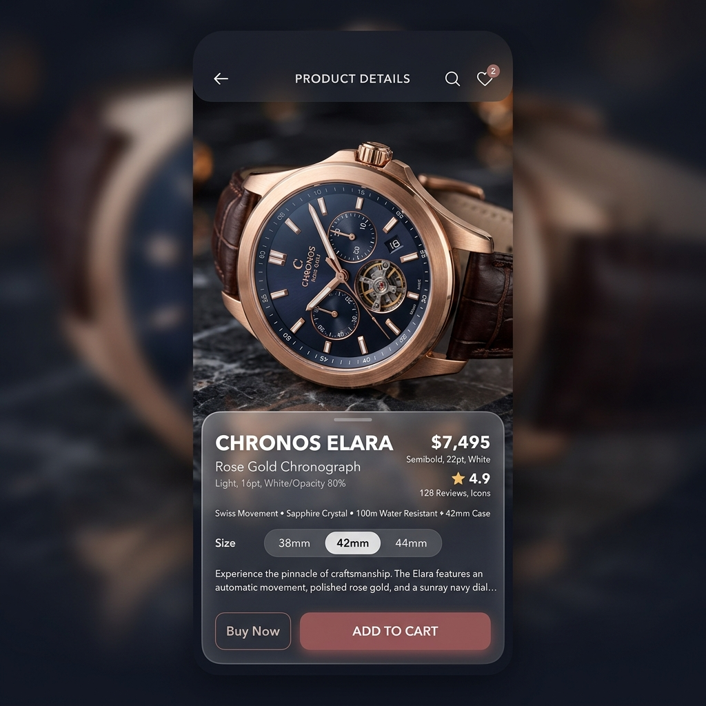

# The Pavilion | Premium E-Commerce Marketplace


## 🌟 Overview
**The Pavilion** is a production-ready, high-end e-commerce application built with Flutter. Designed for a "Curated Boutique" experience, it features a glassmorphic UI, smooth micro-animations, and a highly scalable Clean Architecture. Developed with a focus on visual excellence and developer experience.

## ✨ Key Features
- **Modern Design System**: Custom glassmorphism-inspired UI with vibrant gradients and premium typography.
- **Clean Architecture**: Strictly separated Domain, Data, and Presentation layers for maximum maintainability.
- **BLoC State Management**: Robust and predictable state handling for complex user flows.
- **Responsive Design**: Optimized for multiple mobile screen sizes with a fluid layout.
- **RTL Support**: Built-in support for Arabic and English localization.
- **Search & Filtering**: Real-time search integration with category-based browsing.
- **Advanced Checkout Flow**: Optimized path-to-purchase with saved addresses and checkout validation.

## 📸 Screenshots

| Onboarding & Brand | Dashboard |
| :---: | :---: |
|  |  |

| Product Details | Checkout Experience |
| :---: | :---: |
|  |  |

## 🛠 Tech Stack
- **Core**: Flutter / Dart
- **State Management**: flutter_bloc (v9.1+)
- **Routing**: go_router (Declarative navigation)
- **Dependency Injection**: get_it (v9.2+)
- **Networking**: Dio
- **Storage**: shared_preferences
- **Localization**: Custom JSON-based L10n system

## 📂 Project Structure
```text
lib/
├── core/               # App-wide constants, themes, and routing
├── features/           # Feature-first modular structure
│   ├── home/           # Dashboard and search
│   ├── product/        # Product catalogs and details
│   ├── cart/           # Cart management and checkout
│   └── auth/           # Login and onboarding
├── shared/             # Reusable widgets and common entities
└── main.dart           # App entry point
```

## 🚀 Getting Started

### Prerequisites
- Flutter SDK (v3.11+)
- Android Studio / VS Code with Flutter extensions

### Installation
1. Clone the repository:
   ```bash
   git clone https://github.com/yourusername/the-pavilion.git
   ```
2. Fetch dependencies:
   ```bash
   flutter pub get
   ```
3. Run the application:
   ```bash
   flutter run
   ```

## 📄 License
Internal project for **The Pavilion**. All rights reserved.
