<p align="center">
  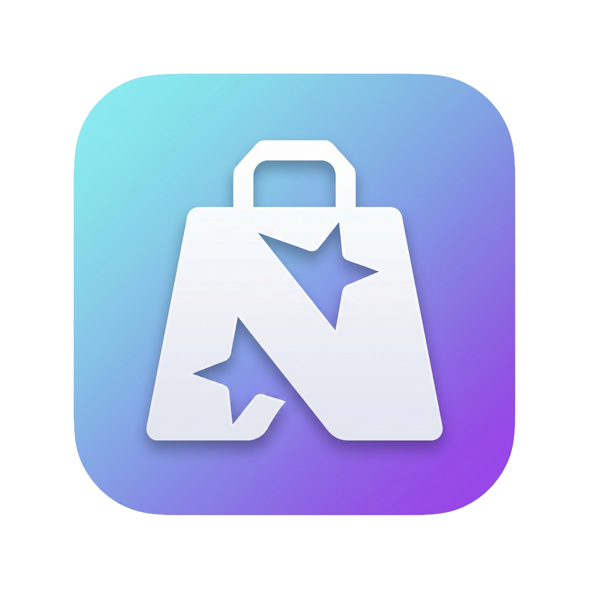
</p>

<h1 align="center">NovaStore</h1>

<p align="center">
  <strong>A premium, production-ready e-commerce mobile app built with Flutter & Firebase</strong>
</p>

<p align="center">
  
  
  
  
  
</p>

<p align="center">
  <a href="https://stitch.withgoogle.com/projects/17376586620053144181">🎨 View Full Design on Google Stitch</a>
</p>

---

## 📱 Screenshots

<p align="center">
  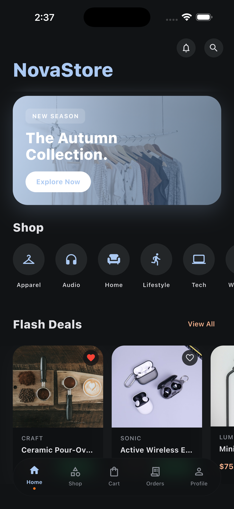
  &nbsp;
  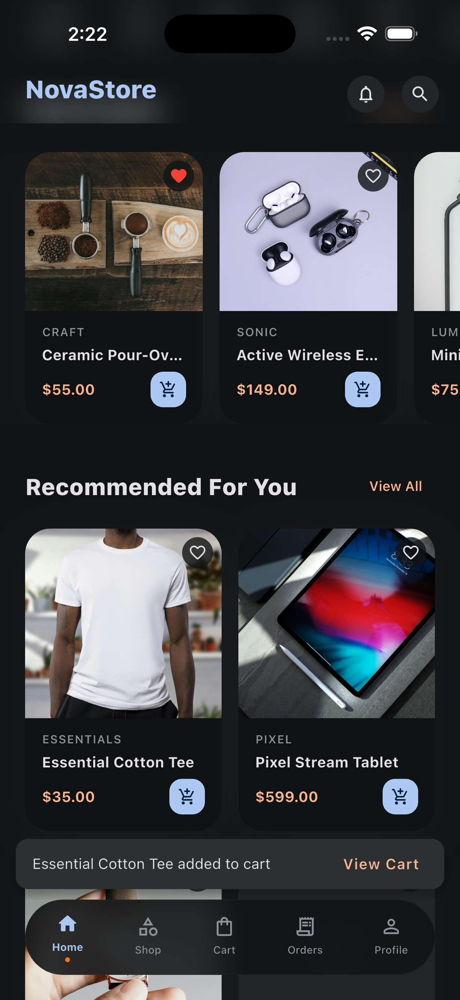
  &nbsp;
  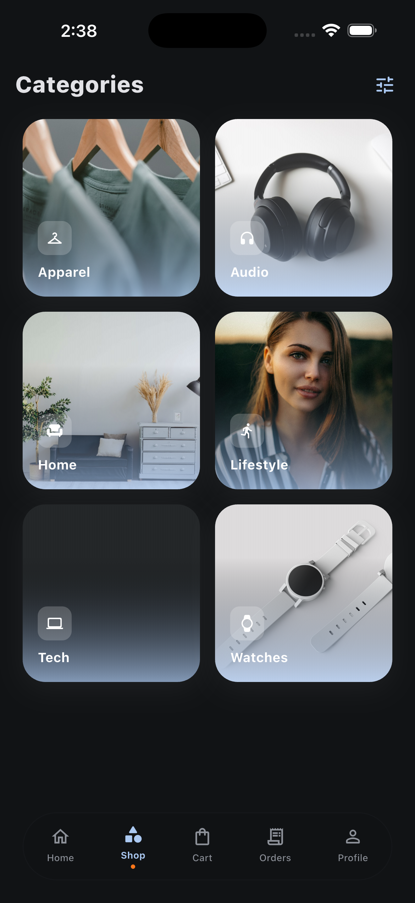
  &nbsp;
  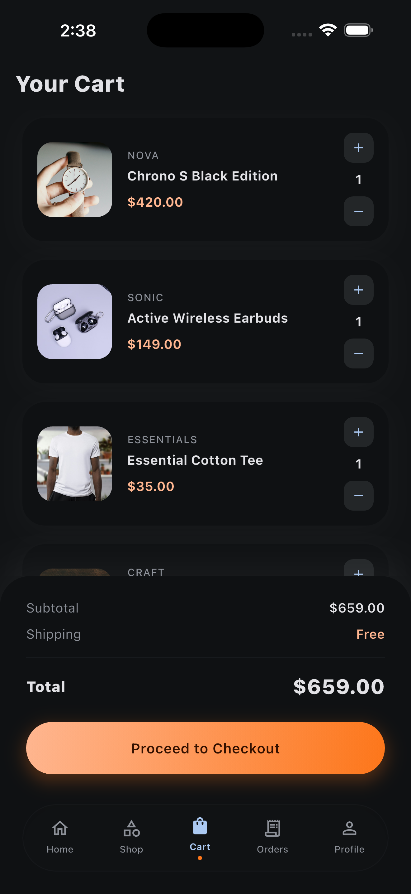
</p>

<p align="center">
  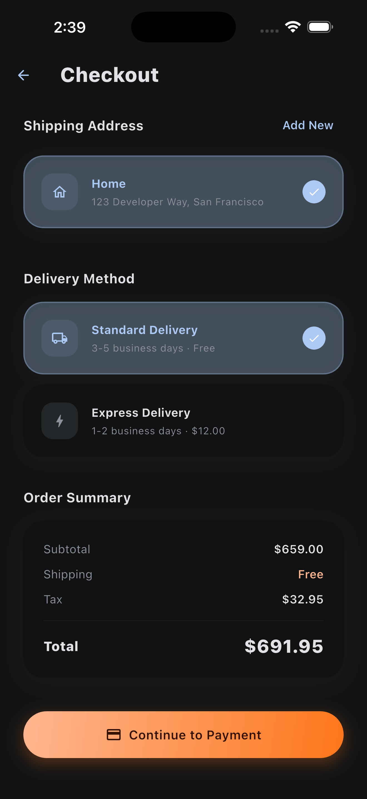
  &nbsp;
  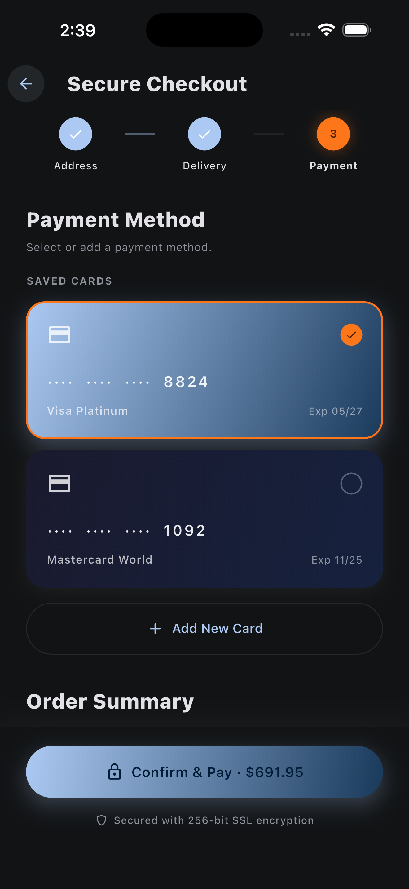
  &nbsp;
  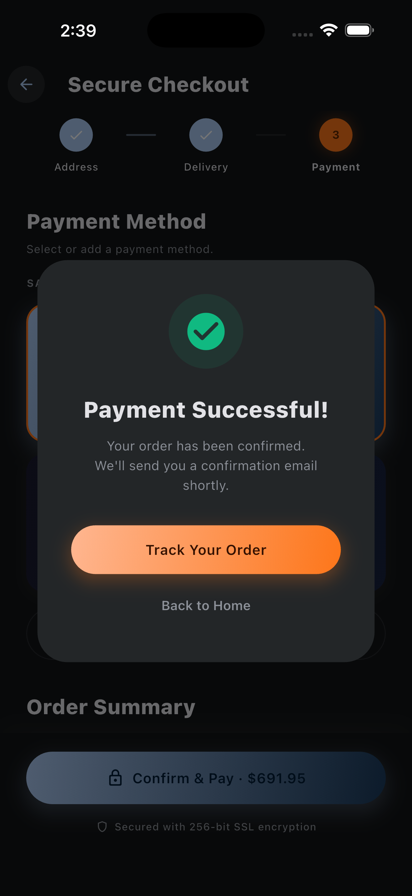
  &nbsp;
  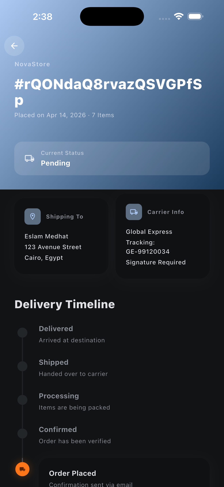
</p>

<p align="center">
  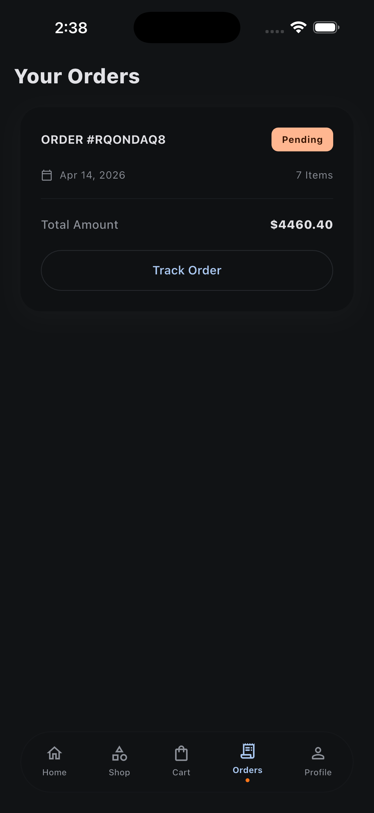
  &nbsp;
  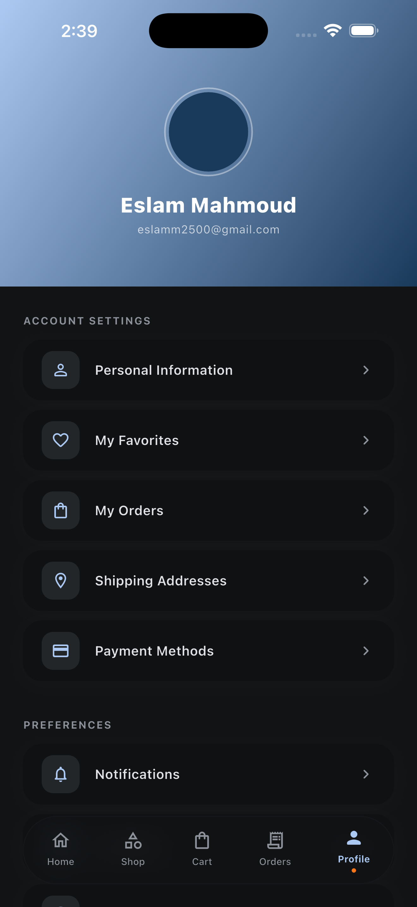
</p>

---

## ✨ About the Project

**NovaStore** is a full-featured, luxury e-commerce application designed and built from scratch as a showcase of modern Flutter development practices. It demonstrates expertise in **clean architecture**, **reactive state management**, **Firebase backend integration**, and **premium UI/UX design**.

The app's design system — *"The Curated Pavilion"* — follows an editorial, border-free aesthetic inspired by high-end digital galleries. Every screen was first prototyped in [Google Stitch](https://stitch.withgoogle.com/projects/17376586620053144181) and then implemented pixel-for-pixel in Flutter with Material 3 theming.

> **This project is intended as a portfolio piece** demonstrating production-level Flutter skills, architectural decision-making, and end-to-end mobile development proficiency.

---

## 🏗️ Architecture

NovaStore follows **Clean Architecture** principles with a clear separation of concerns:

```
lib/
├── main.dart                          # App entry point
├── firebase_options.dart              # Firebase config
│
├── core/                              # App-wide infrastructure
│   ├── bloc/                          # Global state (theme, locale)
│   ├── constants/                     # App constants & mock data
│   ├── di/                            # Dependency injection (GetIt)
│   ├── error/                         # Failure & exception handling
│   ├── localization/                  # i18n (EN / AR)
│   ├── network/                       # Network layer (Dio, connectivity)
│   ├── routing/                       # GoRouter navigation
│   ├── services/                      # Notification service
│   ├── theme/                         # Material 3 theme, colors, typography
│   └── utils/                         # Helpers & extensions
│
├── features/                          # Feature modules (Clean Arch)
│   ├── auth/                          # 🔐 Authentication
│   │   ├── data/                      #    Firebase Auth datasource & repo
│   │   ├── domain/                    #    Entities, repos, use cases
│   │   └── presentation/             #    AuthBloc, Login, Sign Up, OTP
│   │
│   ├── home/                          # 🏠 Home & Discovery
│   │   └── presentation/             #    ProductsBloc, HomePage
│   │
│   ├── product/                       # 📦 Product Details
│   │   └── presentation/             #    Product detail page
│   │
│   ├── search/                        # 🔍 Search & Filter
│   │   └── presentation/             #    Search results page
│   │
│   ├── shop/                          # 🛍️ Shop / Categories
│   │   └── presentation/             #    Shop page with grid layout
│   │
│   ├── cart/                          # 🛒 Shopping Cart
│   │   └── presentation/             #    CartBloc, cart page
│   │
│   ├── checkout/                      # 💳 Checkout Flow
│   │   └── presentation/             #    Address, payment, confirm
│   │
│   ├── order/                         # 📋 Orders & Tracking
│   │   └── presentation/             #    OrdersBloc, tracking page
│   │
│   ├── favorites/                     # ❤️ Favorites / Wishlist
│   │   ├── data/                      #    Local datasource & repo
│   │   ├── domain/                    #    FavoriteItem entity & repo
│   │   └── presentation/             #    FavoritesBloc, favorites page
│   │
│   ├── notifications/                 # 🔔 Notification Center
│   │   ├── domain/                    #    NotificationItem entity
│   │   └── presentation/             #    Notification page
│   │
│   ├── profile/                       # 👤 User Profile
│   │   └── presentation/             #    AddressBloc, profile page
│   │
│   ├── onboarding/                    # 🎬 Onboarding
│   │   └── presentation/             #    Swipeable intro screens
│   │
│   └── splash/                        # ⚡ Splash Screen
│       └── presentation/             #    Animated brand splash
│
└── shared/                            # Shared components
    ├── data/models/                   # Shared data models
    ├── domain/entities/               # Product entity
    └── widgets/                       # Reusable widgets
```

---

## 🎨 Design System — *The Curated Pavilion*

The UI follows a bespoke design system emphasizing **tonal layering** over borders, **editorial typography**, and **glassmorphic surfaces**:

| Token | Value | Usage |
|-------|-------|-------|
| **Primary** | `#002444` Deep Navy | Headers, CTAs, authority elements |
| **Secondary** | `#FD761A` Coral Orange | Conversion actions (Add to Cart) |
| **Surface** | `#F7F9FB` | Base background |
| **Headline Font** | Plus Jakarta Sans | Display & headline text |
| **Body Font** | Inter | Body copy & labels |
| **Corner Radius** | Full (pill) | Buttons, chips, nav bar |

### Design Principles

- **🚫 No-Line Rule** — Boundaries defined by surface color shifts, never 1px borders
- **🪟 Glassmorphism** — Floating nav with 80% opacity + backdrop blur
- **🎭 Tonal Layering** — Depth through ambient surface stacking, not drop shadows
- **📐 Intentional Asymmetry** — Editorial layouts that break the "template" feel

> 🔗 [**Explore the full design on Google Stitch →**](https://stitch.withgoogle.com/projects/17376586620053144181)

---

## 🚀 Key Features

### Implemented ✅

| Feature | Description |
|---------|-------------|
| **Onboarding** | Multi-page swipeable intro with premium imagery |
| **Authentication** | Firebase Auth — email/password, guest mode, OTP verification |
| **Home & Discovery** | Category browsing, new arrivals, trending sections |
| **Product Details** | Full-bleed imagery, size selection, reviews, add to cart |
| **Search** | Real-time product search with results |
| **Shop / Categories** | Grid-based category browsing |
| **Shopping Cart** | Add/remove items, quantity control, price calculation |
| **Checkout** | Multi-step: address → delivery → payment → confirmation |
| **Order Management** | Order list, status tracking with timeline stepper |
| **Favorites / Wishlist** | Toggle favorites from product cards & details, dedicated favorites page |
| **Notification Center** | In-app notification feed with update, order & promotion categories |
| **User Profile** | Profile display, address management |
| **Dark / Light Mode** | Full Material 3 theme switching |
| **Localization** | English & Arabic (RTL) support |
| **Shimmer Loading** | Skeleton UI states across all pages |
| **Pull to Refresh** | Refresh data on Home, Cart, and Orders |
| **Network Monitoring** | Offline banner with connectivity detection |
| **Crash Reporting** | Firebase Crashlytics integration |
| **Push Notifications** | Firebase Cloud Messaging with automatic token sync & deep-link navigation |

---

## 🛠️ Tech Stack

| Layer | Technology |
|-------|-----------|
| **Framework** | Flutter 3.11 / Dart 3.11 |
| **State Management** | flutter_bloc / BLoC |
| **Navigation** | GoRouter (declarative routing) |
| **Backend** | Firebase (Auth, Firestore, Storage, FCM) |
| **DI** | GetIt + injectable pattern |
| **Networking** | Dio with interceptors |
| **Error Handling** | Dartz (Either/Failure pattern) |
| **Theming** | Material 3 with custom design tokens |
| **Fonts** | Google Fonts (Plus Jakarta Sans, Inter) |
| **Images** | Cached Network Image |
| **Local Storage** | SharedPreferences |
| **Analytics** | Firebase Analytics |
| **Crash Reporting** | Firebase Crashlytics |
| **Testing** | flutter_test, bloc_test, mocktail |

---

## 🏃 Getting Started

### Prerequisites

- Flutter SDK `^3.11.1`
- Dart SDK `^3.11.1`
- Firebase project configured
- Android Studio / VS Code

### Installation

```bash
# Clone the repository
git clone https://github.com/DevEslam/NovaStore.git
cd NovaStore

# Install dependencies
flutter pub get

# Run the app
flutter run
```

### Firebase Setup

1. Create a Firebase project at [console.firebase.google.com](https://console.firebase.google.com)
2. Add Android & iOS apps to the project
3. Download and place config files:
   - `google-services.json` → `android/app/`
   - `GoogleService-Info.plist` → `ios/Runner/`
4. Run `flutterfire configure` to generate `firebase_options.dart`

---

## 📂 Screens Overview

| Screen | Description |
|--------|-------------|
| Splash | Animated brand intro with auth state check |
| Onboarding | 3-page premium intro carousel |
| Login / Sign Up | Email & password authentication |
| OTP Verification | 6-digit pin code verification |
| Home & Discovery | Hero banners, categories, product grids |
| Product Details | Immersive product view with size picker |
| Search Results | Real-time search with product cards |
| Shop / Categories | Filterable category grid |
| Shopping Cart | Cart management with price summary |
| Checkout: Address | Address selection & delivery options |
| Checkout: Payment | Payment method & order confirmation |
| Order Success | Confirmation with order details |
| Order Tracking | Timeline stepper with status updates |
| Favorites | Saved products grid with heart toggle |
| Notifications | In-app notification feed (updates, promotions, orders) |
| User Profile | Account info & address management |
| Filter Modal | Price, category, brand, rating filters |
| Empty / Error States | Graceful empty cart, no results, errors |
| Skeleton Loading | Shimmer placeholders for all pages |

---

## 🧪 Testing

```bash
# Run all unit & widget tests
flutter test

# Run with coverage
flutter test --coverage
```

---

## 📄 License

This project is for **portfolio and demonstration purposes**. Feel free to use it as a reference or learning resource.

---

<p align="center">
  <strong>Built with ❤️ by Eslam</strong>
  <br />
  <em>Flutter Developer · Mobile Engineering · Clean Architecture Enthusiast</em>
</p>

<p align="center">
  <a href="https://linkedin.com/in/DevEslam">
    
  </a>
  &nbsp;
  <a href="https://github.com/DevEslam">
    
  </a>
</p>
